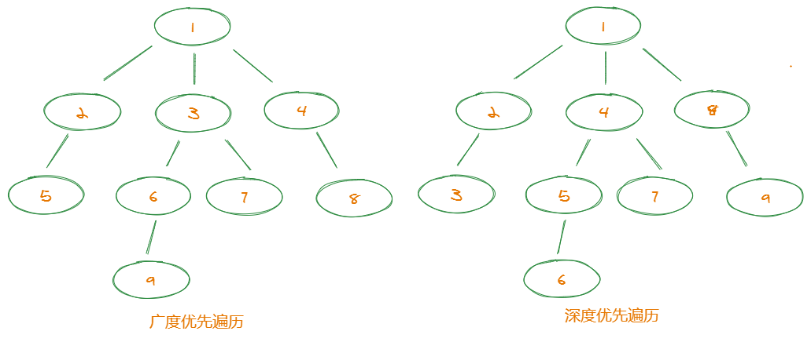

# 数据结构与算法 Data Structure and Algorithms

## 栈 Stack

1. 后进先出(LIFO, Last In - First Out)

## 队列 Queue

## 链表 LinkedList

## 树 Tree

## 广度优先遍历（BFS）和 深度优先遍历（DFS）



### BFS: 广度优先遍历 Breadth First Search

1. 广度优先遍历一层一层地进行遍历，每层遍历都将上一层遍历的结果为起点，遍历过的节点不再遍历
2. 在上图所示的无向图中，BFS 的遍历顺序为：**1，2，3，4，5，6，7，8，9**
3. 程序实现方式：
   - 创建一个队列，将根节点放入队列
   - 判断队列是否为空，非空则从队列中取出第一个节点，并判断是否为目标节点
   - 如是目标节点就结束遍历，非不是目标节点则将它所有没有被检测过的子节点加入队列
   - 如队列为空，表示图中并没有目标节点，结束遍历
4. 注意点：
   - 队列：用来存储每一轮遍历得到的节点
   - 标记：用于标记遍历过的节点，防止重复遍历

### DFS: 深度优先遍历 Deepth First Search

1. 深度优先遍历是一种
2. 在上图所示的无向图中，DFS 的遍历顺序为：**1，2，5，3，6，9，7，4，8**

## dijkstra 算法

## 动态规划 （Dynamic Programming, DP）

- Dynamic programming is a method for solving a complex problem by breaking it down into a collection of simpler subproblems
- 动态规划是运筹学的一个分支，是求解决策过程(decision process)最优化的数学方法，其本质是将一个复杂的问题拆分成一系列子问题
- DP 的关键步骤：
  1. 定义**状态**
  2. 定义**状态转移方程**
  3. 找到**边界情况**

### 经典的动态规划题目

#### 1.爬楼梯问题

- 题目：假设你正在爬楼梯。需要 n 阶你才能到达楼顶。每次你可以爬 1 或 2 个台阶。你有多少种不同的方法可以爬到楼顶？

- 解析：

  - 定义一个数组`dp[]`来表示爬到某阶楼梯的方法总数，`dp[i]`则表示爬到第`i`阶的方法数，本题目就是求`dp[n]`的值（**_定义状态_**）
  - 由此我们可以得到，`dp[i] = dp[i-1] + dp[i-2]`（**_定义状态转移方程_**）
  - 计算边界情况：`dp[0] = 0`, `dp[1] = 1`

- 总结公式：

  $$
  dp(n) = \begin{cases}
  n,\quad n = 0,1,2 \\
  dp(n-1) + dp(n-2),\quad n \geq 3 \\
  \end{cases}
  $$

- 代码：

```JavaScript
const climbStairs = function (n) {
  // 定义一个状态
  const dp = []

  // 定义初始值
  dp[0] = 0
  dp[1] = 1
  dp[2] = 2

  // 定义状态转移方程
  for (let i = 3; i <= n; i++) {
    dp[i] = dp[i - 1] + dp[i - 2]
  }

  return dp[n]
};
```

#### 2.网格问题

- 题目：在一个`m*n`的网格中，机器人从网格左上角向右下角移动，一次只能向下或向右移动一格，问总共有多少种不同的路径？

- 解析：

  - 定义一个二位数组`dp[][]`来表示移动到某个网格的路径总数，`dp[i][j]`则表示第`i`行第`j`列的路径总数，本题目就是求`dp[m][n]`的值（**_定义状态_**）
  - `dp[i][j] = dp[i][j-1] + dp[i-1][j]`（**_定义状态转移方程_**）
  - 计算边界情况：`dp[0][0] = 1`, `dp[0][j] = 1`, `dp[i][0] = 1`

- 总结公式：

  $$
  dp(m,n) = \begin{cases}
  1,\quad m=0 \\
  1, \quad n=0 \\
  dp(m)(n-1) + dp(m-1)(n),\quad m\neq0 \And n\neq0 \\
  \end{cases}
  $$

- 代码

```JavaScript
const uniquePaths = function (m, n) {
  // 定义一个二维数组表示状态
  const dp = []

  // 定义初始值
  for (let i = 0; i < m; i++) {
    dp.push([])
    dp[i][0] = 1
  }
  for (let i = 0; i < n; i++) {
    dp[0][i] = 1
  }

  // 定义状态转移方程
  for (let i = 1; i < m; i++) {
    for (let j = 1; j < n; j++) {
      dp[i][j] = dp[i - 1][j] + dp[i][j - 1]
    }
  }

  return dp[m - 1][n - 1]
};
```

#### 3. 0-1 背包问题

- 题目：给定一个可装载重量为`w`的背包和`n`个物品，每个物品有重量和价值两个属性。其中第`i`个物品的重量为`wt[i]`，价值为`val[i]`，现在让你用这个背包装物品，最多能装的价值是多少？

- 解析：

  - 定义状态：对于每个物品，都有**装入**和**不装入**背包两种选择，这也是`0-1`背包问题叫法的来源
  - 定义一个二维数组`dp[][]`来表示最大价值，`dp[i][w]`的定义如下：对于前`i`个物品，当前背包的容量为`w`，这种情况下可以装的最大价值是`dp[i][w]`。
  - 状态转移方程：`dp[i][w] = max(dp[i-1][w-wt[i]] + val[i], dp[i-1][w])`, 也就是装和不装第`i`个物品的最大值
  - 边界情况：`dp[0][1...w] = dp [1...i][0] = 0`

- 总结公式：

$$
dp(i, w) = \begin{cases}
0, \quad i=0 \quad or\quad w=0 \\
max(dp(i-1, w-wt[i]) + val[i], dp(i-1, w)), \quad i\neq0 \And w\neq0
\end{cases}
$$

- 代码：

```JavaScript
/**
 * @param {number[]} cost 所占空间
 * @param {number[]} val 所属价值
 * @param {number} total 给定空间
 * @return {number}
 */
const zeroOnePack = function (cost, val, total) {
  const dp = []

  const base = Array(total + 1).fill(0)
  dp.push(base)

  const len = val.length
  for (let i = 1; i < len + 1; i++) {
    dp.push([0])
    for (let j = 1; j < total + 1; j++) {
      let [inPack, notInPack] = [0, 0]
      // 如果空间足够的话 装和不装选价值大的
      if (j >= cost[i - 1]) {
        inPack = dp[i - 1][j - cost[i - 1]] + val[i - 1]  // 装
        notInPack = dp[i - 1][j] // 不装
        dp[i][j] = Math.max(inPack, notInPack)
      } else { // 空间不足 只能选择不装
        dp[i][j] = dp[i - 1][j]
      }
    }
  }

  return dp[len][total]
};

const res = zeroOnePack([1, 2, 3], [2, 3, 1], 6);

```

#### 参看文章

1. [动态规划套路解析](https://zhuanlan.zhihu.com/p/91582909)
2. [算法总结-动态规划问题](https://labuladong.gitbook.io/algo/dong-tai-gui-hua-xi-lie)

## 回溯

回溯问题的关键

1. 路径：即已经做出的选择
2. 选择列表：当前可以做的选择
3. 结束条件：到达决策树底层，无法再继续做选择

代码方面的框架（伪代码）

```javascript
result = []
function backtrack(路径, 选择列表) {
  if 满足条件：
    result.push(路径)
    return

  for 选择 in 选择列表：
    做选择
    backtrack(路径, 选择列表)
    撤销选择
}
```

### 参考文章

1. [回溯算法详解](https://mp.weixin.qq.com/s/nMUHqvwzG2LmWA9jMIHwQQ)

## 贪心算法 （Greedy Algorithm）

- A greedy algorithm is any algorithm that follows the problem-solving heuristic of making the locally optimal choice at each stage[1] with the intent of finding a global optimum.
- 贪心算法是一种在每一步选择中都采取在当前状态下最好（最优、最有利）的选择，从而希望导致结果是最好（最优、最有利）的算法。
- 贪心算法的本质是**局部最优解**。
- GA 的基本思路：
  1. 建立数学模型，定义状态
  2. 将求解的问题分成若干子问题
  3. 对每一个子问题求解，得到子问题的局部最优解
  4. 把子问题的局部最优解合成原问题的解
- GA 的实现步骤：
  ```javascript
    从问题的某一初始解出发；
    while （能朝给定总目标前进一步）{
      利用可行的决策，求出可行解的一个解元素
    }
    由所有解元素组合成问题的一个可行解；
  ```

1. (贪心算法)[https://zh.wikipedia.org/wiki/%E8%B4%AA%E5%BF%83%E7%AE%97%E6%B3%95]
