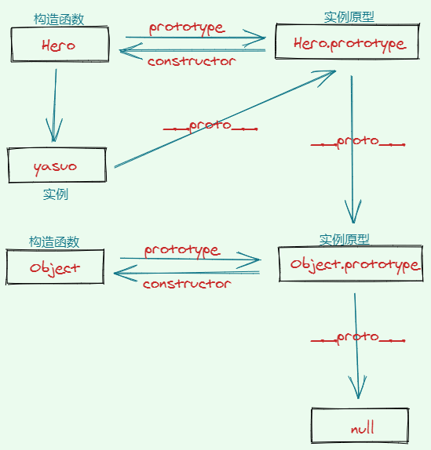

# JavaScript 基础

## 构造函数和实例、原型和原型链

### 构造函数和普通函数

- 构造函数和普通函数的本质都是函数，直接用于调用的就是普通函数，而能使用`new`关键字生成**实例**的就是构造函数，构造函数的首字母一般大写，便于区分；

### 注意点

- 只有函数才有`prototype`属性

```javascript
function Hero(name, options) {
  this.name = name
  this.options = options
}
const yasuo = new Hero('yasuo', { country: 'Japan' })

Hero.prototype.constructor === Hero // true
yasuo.__proto__ === Hero.prototype // true
Object.getPrototypeOf(yasuo) === Hero.prototype // true
Object.prototype.__proto__ // null
```



## 事件循环（Event Loop）和消息队列（Message Queue）

### 名词解释

1. 单线程（Single-Threaded）：
   - 与多线程相对，指的是代码程序由上至下的顺序依次执行，同一时间只能执行一件任务。
2. 非阻塞（Non-Blocking）和异步（Asynchronous）：
   - 单线程的优势是系统稳定，开发容易；但是最大的问题就是上一个任务完成之后才开始下一个任务的执行，如果上一个任务花费了大量的时间的话，比如数量级的循环（1-10000000）、网络请求（network request）和图像处理（image processing）等等，就会造成调用栈的阻塞，从而造成浏览器渲染的阻塞卡死。
3. 调用栈（Call Stack）和内存堆（memory Heap）:
   - 调用栈（先进后出 FILO）是一种数据结构，记录了程序执行的位置；当我们执行一个函数的时候，就会向其推入（push）调用栈，当这个函数执行完毕后，就会将其推出（pop）
   - 调用栈可以识别一系列的 Web API，并将它们交给浏览器运行，一旦这些任务被浏览器执行完毕后，它们会以回调函数的形式再次被推入调用栈
   - 在程序报错的时候我们往往能在`console`中看到调用栈的信息，从中能定位到具体的错误代码。
   - 内存堆负责存放各种对象和执行函数的引用
4. Web API：

   - 一些 javascript 处理不了交给浏览器处理的 API：`setTimeout()`, `fetch()`, `XHR`等等

5. 宏任务（Macrotasks）和微任务（Microtasks）
   - 事件循环会有一个或多个消息队列（也就是宏任务队列），但是只有一个微任务队列，在当前任务队列执行完毕后，就会执行微任务队列；
   - 宏任务：`script`, `setTimeout`, `setInterval`, `setImmediate`, `I/O`, `UI rendering`
   - 微任务：`process.nextTick`, `Promises`, `Object.observe(废弃)`, `MutationObserver`

### 核心原理

- JavaScript 是单线程的，意味着它只存在一个调用栈，一次只能执行一个任务。
- 浏览器是多线程的，JavaScript 的运行时（比如 V8, Spidermonkey, JavaScriptCore 等等）提供了一系列的 Web API 来让浏览器帮助我们处理阻塞任务；
- 调用栈识别到这些 Web API 后，就会将其交给浏览器处理，而主线程依旧往下执行
- 当浏览器处理完这些任务后，会将其以回调函数的形式推入消息队列
- 当主线程的代码执行完毕后，消息队列（先进先出 FIFO）的消息会被推入调用栈继续执行，这就形成了一次事件循环
- 继续重复以上的步骤，直至消息队列为空，任务全部执行完毕

### 考虑 UI 渲染性能

浏览器的渲染频率是 60HZ，也就是 16.6ms 更新一次视图。但是当执行栈上有任务的时候，它是不执行渲染的，因为浏览器的**GUI 渲染线程**和**JavaScript 引擎线程**是相斥的。所以 JS 代码可能会阻碍视图的正常更新，需要对 js 代码做优化（optimization）处理。

### 其他知识点

1. 函数`setTimeout`接收两个参数，待加入队列消息和一个时间值，这个时间值仅仅表示消息被实际加入队列的最小延迟时间，而非确切的等等时间
2. Vue 中`nextTick()`的底层原理

### 参考文章

1. [任务，微任务，队列](https://jakearchibald.com/2015/tasks-microtasks-queues-and-schedules/)
2. [HTML Standard](https://html.spec.whatwg.org/multipage/webappapis.html#event-loop-processing-model)
3. [MutationObserver 只是浮云，microtask 才是核心](https://github.com/Ma63d/vue-analysis/issues/6)
4. [从 event loop 规范探究 javaScript 异步及浏览器更新渲染时机](https://github.com/aooy/blog/issues/5)
5. [从 Vue.js 源码看 nextTick 机制](https://zhuanlan.zhihu.com/p/30451651)
6. [nextTick 为什么要 microtask 优先？](https://juejin.im/post/5d57994ef265da03bd051969#comment)
7. [浏览器的工作原理：新式网络浏览器幕后揭秘](https://www.html5rocks.com/zh/tutorials/internals/howbrowserswork/)

## Garbage Collection 垃圾收集&内存管理
