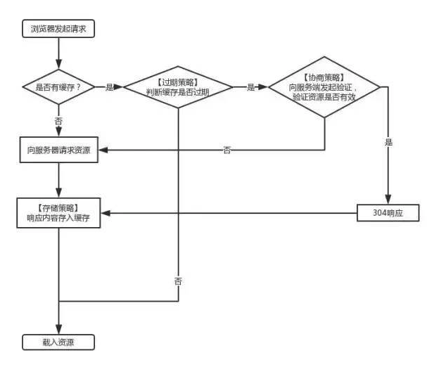

# 计算器网络基础

## TCP/IP

- TCP：传输控制协议（Transmission Control Protocol）
- IP：网际协议（Internet Protocol）

### TCP 三次握手

#### 三次握手的流程

1. 第一次握手：由客户端发起一次 TCP 连接请求，向客户端发送请求**连接报文**，报文首部的同步位 SYN 位置为 1，表示客户端发起请求，并且随机选择一个初始序号`seq = x`，此时客户端进入**SYN-SENT（同步发送完成）**状态
2. 第二次握手：服务端接受到客户端发来的请求后，需要向客户端发送**确认报文**，报文中将同步位 SYN 和确认位 ACK 都置为 1，即`SYN = 1, ACK = 1`，并且随机选择一个初始序号`seq = y`，确认序号为`ack = x + 1`(和之前客户端发来的 x 对应)，此时服务端进入**SYN-RCVD（同步收到）**状态
3. 第三次握手：客户端收到服务器的确认信号后，再次向服务端发送**确认报文**，报文中确认位 ACK 置为 1，确认号为 y+1，序号为 x+1, 即`ACK = 1, ack = y + 1, seq = x + 1`，此时客户端和服务端都进入**ESTABLISHED(建立完成)**状态，TCP 连接完成

#### TCP 连接为什么需要三次握手

1. TCP 区别去 UDP，是一种面向连接的可靠的连接协议。三次握手的目的时为了同步连接双方的序列号和确认号并交换 TCP 窗口大小信息。
2. TCP 需要三次握手主要是为了防止已失效的连接请求报文再次传送到服务端，造成连接无法关闭连接的情况；
3. 二次握手的不足点：假设客户端因为网络原因，第一次请求并没有到达客户端（请求并未丢失，只是造成滞留），而再次重发的请求到客户端后顺序建立连接。此时刚才丢失的第一次请求再次到达服务端，服务端会再次接收建立连接，但此时客户端并没有数据的发送，会造成服务端一直处于信号接受状态，造成资源浪费

### TCP 四次挥手

#### 四次挥手的流程

1. **_第一次挥手_**：客户端停止发送数据，发送连接**释放报文**；报文首部终止位`FIN`置为 1，序列号为 u（等于之前传送的数据的最后一个字节序号加 1），即`FIN = 1, seq = u`，客户端进入**FIN-WAIT-1（终止等待 1）**状态
2. **_第二次挥手_**：服务端接受到连接释放报文，发出**确认报文**；报文首部确认位`ACK`置为 1，确认号为 u+1，同时带上自己的序列号 seq 为 v，即`ACK = 1, ack = u + 1, seq = v`，服务端进入**CLOSE-WAIT（关闭等待）**状态，此时服务端还是可以继续发送未发送完成的数据到客户端，
3. 客户端收到服务端的确认请求后，进入**FIN-WAIT-2（终止等待 2）**状态，在此之前还需要接受服务端发送的最后的数据
4. **_第三次挥手_**：服务端将最后的数据发送完毕后，向客户端发送连接**释放报文**；报文首部终止位`FIN`置为 1，确认位`ACK`置为 1，确认序号为 u+1，由于此时处于半关闭状态，可能还有数据的发送，假定此时的序列号 seq 为 w, 即`FIN = 1, ACK = 1, ack = u + 1, seq = w`，服务端进入**LAST-ACK（最后确认）**状态
5. **_第四次挥手_**：客户端收到服务端的连接释放报文，发出确认报文，即`ACK = 1, ack = w + 1, seq = u + 1`, 进入**TIME-WAIT**状态，注意：此时 TCP 连接还未关闭，必须经过`2*MSL（Maximum Segment Lifetime）`（最后报文段寿命）时间后，才进入**CLOSED**状态；
6. 服务端收到客户端的确认信号后，立即进入**CLOSE**状态，由此可见，服务端的 TCP 连接关闭是要早于客户端的

#### TCP 关闭为什么需要四次挥手

1. TCP 连接是一个全双工模式的连接，
2. 通信一方发起关闭报文后，只能表示己方没有数据需要发送，但是依然可以接受另一方传输过来的数据；
3. 当另一方发送关闭确认报文后，只能表示己方已经知道对方没有数据需要发送，但是己方依然可以发送数据给对方；
4. 只有当另一方也发送关闭请求报文后，才表示己方也没有数据需要发送，此时才可以进行真正的关闭操作；

## HTTP

### HTTP 简介

- HTTP：超文本传输 ​​ 协议（Hypertext Transfer Protoco），一个用于分布式、协作式和超媒体信息系统的**应用层**协议
- HTTP 基于 TCP/IP 通信协议来传输数据，是一个标准的**B/S（brower 浏览器/server 服务端）**模型，HTTP 协议总是由 HTTP 客户端向 HTTP 服务端发起请求

### HTTP 主要特点

1. 简单快捷：客户端向服务器请求服务时，只需传送请求方法和路径
2. 灵活：HTTP 允许传输任意类型的数据对象，类型由 `Content-Type` 加以标记
3. 无状态（stateless）：对于发送过的请求和响应都不做持久化处理，但是可以通过**Cookies/Session**来实现有状态的会话

### HTTP 发展（短连接/长连接/管道化/多路复用）

1. HTTP/0.9 时代：**短连接**，即每次 HTTP 请求都要经历一次 DNS 解析，TCP 连接
2. HTTP/1.0 时代：提出**持久连接**，即一次 TCP 连接服务多个请求，客户端通过添加请求头`Connection: Keep-Alive`向服务器请求持久连接；如果服务器支持持久连接，会在响应头里返回`Connection: Keep-Alive`，默认参数是`{timeout=5, max=100}`, 即一个 TCP 连接可以服务至多 5 秒内的 100 次请求
3. HTTP/1.1 时代：默认持久连接，不需要在请求头中携带`Connection: Keep-Alive`；并且提出**pipelining**概念来试图解决**HOLB（Head of Line Blocking）**问题，即客户端可以在一个请求发送完成后不等待响应便直接发起第二个请求，服务端在返回响应时会按请求到达的顺序依次返回；但管道化并没有彻底解决 HOLB，为了让同一个连接中的多个响应能够和多个请求匹配上，响应仍然是按请求的顺序串行返回的
4. HTTP/2 时代：
   - **多路复用 multiplexing**，即让多个请求和响应的传输完全混杂在一起进行，通过`streamId`来互相区别，同时还允许给每个请求设置优先级，服务端会先响应优先级高的请求
   - 建立连接后，一次的请求与被响应，视为*流*，数据传输分为*二进制帧*片段
   - **HPACK 算法**，即对 HTTP 头部字段做数据压缩

### HTTP 报文

#### 请求报文

1. 由**请求行**、**请求头**、**空行**和**请求体**组成
2. 请求行包括**请求方法**、**请求 URL**和**HTTP/版本号**

#### 响应报文

1. 由**响应行**、**响应头**、**空行**和**响应体**组成
2. 响应行包括**HTTP/版本号**、**状态码**和**状态码描述**

#### 常见的头部字段

1. `Accept-Encoding:gzip/compress/deflate/identity(默认)`, 表示客户端支持的内容编码格式，可取值：
2. `Authorization`：表示客户端的认证信息，一般和 JWT 连用
3. `Access-Control-Allow-Methods`：指定客户端访问允许使用的方法或方法列表
4. `Access-Control-Allow-Origin`：指定响应的资源是否被允许与给定的 origin 共享，设置为`*`来允许跨域
5. `Access-Control-Max-Age`：指定预检请求 preflight request 的返回结果可以被缓存的时间，值为-1 表示禁用缓存
6. `ETag`：表示资源的特定版本的标识符，不同的资源对应不用的 ETag 值，便于高效化浏览器缓存机制
7. `If-None-Match`：指定上次服务器返回的资源的标识符，请求头携带此字段，服务器根据该值判断资源是否发生改变
8. `Expires：<http-date>`，指定请求过期的日期/时间，如：`Expires: Wed, 21 Oct 2020 07:28:00 GMT`;
9. `Cache-Control：no-cache/no-store/public/private/max-age=<>`，HTTP/1.1 的新增字段，用于判断浏览器缓存控制规则，优先级高于 Expires
10. `Last-Modified`：指定源头服务器认定的资源做出修改的日期及时间，如：`Last-Modified: Wed, 21 Oct 2020 07:28:00 GMT`
11. `If-Modified-Since`：浏览器再次请求资源时携带的时间值，服务器根据该值判断是否返回新的资源，只在 `GET` 和 `HEAD` 方法中有效
12. Keep-Alive：
13. User-Agent：保护浏览器和代理名称等信息
14. Set-Cookie
15. Cookie：

### HTTP 请求方法

1. GET
2. POST
3. PUT
4. DELETE
5. OPTIONS
6. TRACE
7. CONNECT

### HTTP 状态码

1xx: 表示信息响应(information response)

- `100 Continue` 表示服务器已经接收到请求头，客户端可以继续发送请求体

2xx: 表示成功响应(successful)

- `200 OK` 表示请求已成功，数据已返回
- `201 Created` 表示请求已实现，请求的资源已创建
- `202 Accepted` 表示服务器已接受请求，但尚未处理
- `204 No Content` 表示服务其成功处理了请求，但没有返回内容。使用场景：**PUT**请求进行资源更新，但不需要返回数据给用户，可以返回 204 No Content
- `206 Partial Content` 表示服务其成功处理了部分请求。使用场景：断点续传

3xx: 表示重定向(redirection)

- `300 Multiple Choice` 表示被请求的资源有一系列可供选择的回馈信息
- `301 Moved Permanently` 永久重定向，表示被请求的资源已经被永久移动到新位置，默认会被浏览器缓存，下次请求会使用**新的 URL**
- `302 Found` 临时重定向，表示请求的资源现在临时从不同的 URI 响应请求，下次请求依然使用**老的 URL**
- `304 Not Modified` 协商缓存相关

4xx: 表示客户端错误

- `400 Bad Request` 表示语义有误，当前请求无法被服务器理解 或者 请求参数有误
- `401 Unauthorized` 表示当前请求需要用户验证，客户端可以提交一个包含`Authorization`头的新请求
- `403 Forbidden` 表示服务器已经理解请求，但是拒绝执行
- `404 Not Found` 表示请求失败，请求所希望得到的资源未被在服务器上发现
- `405 Method Not Allowed` 表示请求方法不能用于请求相应的资源
- `406 Not Acceptable` 表示请求的资源的内容特性无法满足请求头中的条件
- `408 Request Timeout` 表示请求超时

5xx: 表示服务器错误

- `500 Internal Server Error` 服务其内部错误
- `501 Not Implemented` 表示请求方法不被服务其支持且无法被处理
- `502 Bad Gateway` 表示网关响应错误
- `503 Service Unavailable` 表示服务器未准备好处理请求，可能是服务其维护或重载而停机
- `504 Gateway Timeout` 表示网关超时

## HTTPS

### HTTPS 的发展

HTTPS(HyperText Transfer Protocol over Secure Socket Layer)

1. 是为了解决 HTTP 通信**明文传输**的缺点而提出的协议，提供对网站服务器的身份认证，保护交换数据的隐私与完整性
2. 相较于 HTTP 默认 80 端口，HTTPS 的默认端口为 443
3. HTTPS 的数据通信依旧是 HTTP，只是利用`SSL/TLS`加密数据包。
4. `SSL`：安全套接层(Secure Socket Layer) / `TLS`：传输层安全协议(Transport Layer Security)

### HTTPS 的原理

#### 对称加密和非对称加密算法

对称加密（Symmetric-key algorithm）

- 该算法的加密和解密使用相同的密钥
- 常见的对称加密算法有：AES、ChaCha20、3DES 等等
- [AES 算法介绍](https://zh.wikipedia.org/wiki/%E9%AB%98%E7%BA%A7%E5%8A%A0%E5%AF%86%E6%A0%87%E5%87%86)

非对称加密 `Asymmetric cryptography`/ 公开密钥加密 `Public-key cryptography`

- 该算法需要 2 个密钥：公开密钥和私有密钥。公钥负责加密，私钥负责解密。使用公钥将明文加密后得到密文，密文通过私钥解密为原来的明文
- 常见的对称加密算法有：RSA、ElGamal、Rabin 等等
- [RSA 算法介绍](<https://en.wikipedia.org/wiki/RSA_(cryptosystem)>)

#### HTTPS 加解密流程

- HTTPS 加解密的是一个**非对称加密** 和 **对称加密** 共同参与的流程
- **非对称加密**用户传输后续**对称加密**所需的密钥（步骤 2-6）
- **对称加密**对真正需要传输的数据进行加密（步骤 7-9）
- 具体流程：

1. 用户在浏览器发起 HTTPS 请求，默认使用服务端的 443 端口进行连接
2. HTTPS 连接时需要一套**CA 数字证书**，该证书由可信任的 CA 机构签发，证书内对应域名的**公钥 Pub-Key**，与之对应的**私钥 Private-Key**则保存在服务端
3. 服务端收到请求，返回配置好的包含**公钥 Pub-Key**的证书给客户端
4. 客户端收到证书，校验合法性（有效期内，域名是否一致等等）
5. 校验通过后，客户端生成一个**随机 Key**，并用证书内的**公钥加密**后，发送给服务端
6. 服务端收到**随机 Key 的密文**，用**私钥**解密后得到这个**随机 Key**
7. 服务端使用这个**随机 Key**对要返回的 HTTP 数据进行**对称加密**，将密文返给客户端
8. 客户端用**随机 Key**对密文对称解密，得到真正的数据
9. 后续 HTTPS 请求使用之前交换好的**随机 Key**进行对称加解密通信，直到本次连接断开

## 浏览器缓存机制

浏览器缓存：重用已获取的资源，减少延迟与网络阻塞，有利于提升网站与应用的性能

浏览器缓存过程：

- 当浏览器发起一个请求：
  - 是否存在本地缓存？
    - 不存在：直接发起请求
    - 存在：根据**强缓存策略**判断是否过期？
      - 未过期：直接载入缓存资源
      - 已过期：根据**协商缓存策略**判断缓存是否有效？
        - 有效：则返回 304 状态码，载入缓存资源
        - 无效：重新请求服务器

### 强缓存相关字段

1. `Expires`：**HTTP/1.0**的字段，其值为服务器返回请求过期的绝对时间，表示在该时间之前，本地缓存始终有效
2. `Cache-Control`：**HTTP/1.1**的字段，优先级高于`Expires`，可选的值有：

   - `no-cache`: 需要进行协商缓存
   - `no-store`: 禁止使用缓存，不存储任务内容
   - `public`：可以被所有的用户缓存，包括终端用户和 CDN 等中间代理服务器
   - `private`：只能被单个用户缓存，不能作为共享缓存
   - `max-age=<seconds>`：缓存到期的最大周期（相对时间），超过该时间则任务过期
   - `s-maxage=<seconds>`：覆盖 max-age 或者 Expires 头

**注意点**：由于`Expires`时间返回的是服务器绝对时间，而客户端本地时间是可以修改的，因此会造成时间的误差和不同步，而`Cache-Control:max-age=<seconds>`返回的是参照客户端第一次请求的相对时间，因此不会受到影响

### 协商缓存相关字段

1. `Last-Modified` / `If-Modify-Since`
2. `ETag` / `If-None-Match`

- 第一组： `Last-Modified` 和 `If-Modify-Since`，浏览器第一次请求服务器资源时，服务器会在响应头内设置`Last-Modified`字段，表示该资源最后修改的时间；浏览器第二次请求资源时，会在请求头内设置`If-Modify-Since`，其值为上一次的`Last-Modified`值，服务器收到`If-Modify-Since`的值后，与服务器资源的`Last-Modified`作比较，如果无变化则返回`304`，不返回资源，不返回`Last-Modified`值，浏览器接收`304`后使用本地缓存

- 第二组：`ETag` 和 `If-None-Match`，浏览器第一次请求服务器资源时，服务器会在响应头内设置`ETag`字段，其值表示该资源的唯一标识符；浏览器第二次请求资源时，会在请求头内设置`If-None-Match`，其值为上一次响应头的`ETag`值，服务器收到`If-None-Match`的值后，与服务器资源的`ETag`作比较，如果两者一致，则说明资源未发生改变，返回`304`，不返回资源，**返回`ETag`值（即使未变化）**，浏览器接收`304`后使用本地缓存

注意点

1. 上述两者是可以一起使用的，但是 `ETag` 的优先级高于 `Last-Modified`，`ETag` 一致的情况下，再比对`Last-Modified`。
2. `ETag` 解决了某些时候，文件未发生改变，但是修改时间发生改变而不需要重新返回新资源的问题。
3. `If-Modified-Since`是秒级的，对于频繁修改的文件识别不准确，比如某个资源 1s 内修改了多次。

## 浏览器存储相关 Cookie/localStorage/sessionStorage/indexedDB

### Cookie

#### 简介

1. 服务器发送到用户浏览器并保存在本地的数据，会在浏览器下次向同一服务器发起请求时被携带并发送到服务器
2. Cookie 使得基于无状态的 HTTP 协议记录状态成为可能
3. Cookie 主要用于：
   - 会话状态管理（用户登录状态、购物车、游戏分数等需要记录的信息）
   - 个性化设置（用户自定义设置、主题）
   - 浏览器行为跟踪
4. Cookie 用于客户端数据的存储已经其他本地存储技术淘汰，因为每次请求都会携带 Cookie 会造成额外的性能开销
5. Cookie 存储上限是 **4K**

#### 属性介绍

1. Cookie 通常由服务端通过设置响应头`Set-Cookie：<key>=<value>`的形式保存到浏览器；
2. 浏览器通常在请求头以`Cookie:<key1>=<value1>;<key2>=<value2>`的形式发送给服务端完成信息交流；
3. 其他重要的属性：
   - `Expires`：设置特定的过期时间，绝对时间，如：`Expires=Wed, 31 Mar 2020 18:00:00 GMT;`
   - `Max-Age`：设置有效期，单位是秒，相对时间，如：`Max-Age: 86400`表示一天后过期
   - `Secure`：标记为 Secure 的 cookie 只能通过 HTTPS 协议加密发送，只在 https 站点适用
   - `HttpOnly`：为避免`XSS`（跨域脚本攻击），`Document.cookie`无法访问带有`HttpOnly`标记的 Cookie
   - `SameSite`：为阻止`CSRF`（跨站请求伪造攻击），可取值为：
     1. `None`：自动携带，浏览器会在**同站请求和跨站请求**下继续发送 cookies
     2. `Strict`：浏览器将只发送**相同站点**请求的 cookie
     3. `Lax`：目前新版本浏览器的默认值，阻止一些跨站子请求发送 Cookie
        - 不发送 Cookie: 图片加载、iframe 等等 -
        - 发送 Cookie：点击`<a>`标签、发送 GET 表单等等

#### Cookie 参考文章

1. [MDN Cookie 介绍](https://developer.mozilla.org/zh-CN/docs/Web/HTTP/Cookies)
2. [惊艳面试官的 Cookie 介绍](https://juejin.im/post/5e57a3ff6fb9a07cb1578d12)
3. [封装的 js-cookie 库](https://github.com/js-cookie/js-cookie)

### localStorage 和 sessionStorage

1. 相同点：

   - 都是存储在**浏览器本地**的
   - 存储的数据大小都为**5M**左右
   - 接口 API 封装完整，可以直接使用
   - 数据均以字符串键值对的形式存储

2. 不同点：`localStorage`和`sessionStorage`有 2 个最大的区别

   - 生命周期不同，`sessionStorage`是会话级别的存储，其保存的数据基于浏览器的一次会话，当会话结束（通常是关闭该窗口），数据即被清空；而`localStorage`是持久化的本地存储，除非手动清除，否则会一直保留在浏览器，即使浏览器关闭
   - `localStorage`可以在同源地址下 share 同一份数据，而`sessionStorage`则还需要同一窗口

3. API 使用

   - 返回保存的数据项个数：`Storage.length`
   - 设置 Storage：`Storage.setItem(key, value)`， 如`localStorage.setItem('name', 'Jalen')`
   - 读取 Storage：`Storage.getItem(key)`， 如`localStorage.getItem('name')`
   - 清除 Storage：`Storage.removeItem(key)`， 如`localStorage.removeItem('name')`
   - 清空 Storage：`Storage.clear()`
   - 监听 storage 的变化：在同一个页面内发生的改变不会起作用，在相同域名下的其他页面（如一个新标签或 iframe）发生的改变才会起作用

   ```javascript
   window.addEventListener('storage', e => {});
   ```

### indexedDB

1. indexedDB 是一个用于在浏览器中储存较大数据结构的 Web API，使用**索引**来实现对该数据的高性能搜索
2. IndexedDB 是一个事务型数据库系统，基于 JavaScript 面向对象以**键值对**的形式存储
3. IndexedDB 是异步的，遵循同源策略

## 鉴权相关 Cookies/Session/Token/JWT 的区别

## 浏览器安全相关

### XSS 和 CSRF

### Cookies：同上

## 跨域

### 同源策略

同源策略是针对于源 Origin 的一种安全策略，用于限制与非同源资源的交互；
两个 URL 同源的标准是**协议 protocol**、**域名 host**、**端口 port**都相同；

### 跨域的解决方案

#### JSONP

- JSONP 请求利用了静态资源请求不受同源策略的影响，如请求`script`、`img`等等
- JSONP 请求需要前后端的配合，并且只能用于`GET`请求
- 一种实现方式

```javascript
const script = document.createElement('script');
script.type = 'text/javascript';
script.scr = 'https://yourDomin/a?data=1&callback=cb';
const cb = res => {
  console.log(JSON.stringify(res));
};
```

#### CORS

- `Cross-Origin Resource Sharing` 跨域资源共享是一种机制，用额外的 `HTTP` 头来告诉浏览器允许请求跨域资源
- `CORS` 通过简单请求(Simple Request)和非简单请求(Non-Simple Request)来完成跨域行为

简单请求需同时满足一下三点：

1. 请求方法只能为 `get/head/post` 之一
2. 只允许认为设置以下 HTTP 头部属性：`Accect`, `Accect-Language`, `Content-Language`, `Content-type`等等， 详见[MDN-简单请求](https://developer.mozilla.org/zh-CN/docs/Web/HTTP/Access_control_CORS)
3. `Content-type`只能是 `text/plain` / `multipart/form-data` / `application/x-www-form-urlencoded`

简单请求相关的 `HTTP` 头部属性，均为服务器的响应头

1. `Access-Control-Allow-Origin` 表示允许接收的域，值 `*` 表示接受任意域名的请求
2. `Access-Control-Allow-Credentials` 表示是否允许发送`Cookie`
3. `Access-Control-Expose-Header` 允许浏览器访问的头

非简单请求:

- 除简单请求外的其他请求
- 非简单请求分成两步，首先使用`OPTIONS`方法发起一个预请求，告知服务器正式请求的 HTTP 信息（请求方法，请求头），

非简单请求相关的 `HTTP` 头部属性

1. `Access-Control-Request-Method` 发起预请求，告知服务器正式请求使用的方法（请求头）
2. `Access-Control-Request-Header` 发起预请求，告知服务器正式请求的额外头信息（请求头）
3. `Access-Control-Allow-Methods` 指定预请求响应中，告知浏览器允许请求的方法（响应头）
4. `Access-Control-Allow-Headers` 指定预请求响应中，告知浏览器允许请求的头信息（响应头）
5. `Access-Control-Max-age` 允许`CORS`预请求的有效期，单位秒，相对时间（响应头）

#### window.postMessage

- `window.postMessage()`是 ES5 新增的用于跨域通信的方法
- 语法：
  1. 发送方：`window.postMessage(data, targetOrigin)`
  2. 接收方：`window.addEventListener('message', (event) => {...}, false);`
- 接收方监听`message`事件的`event`对象有三个参数：
  1. `data` 表示传递过来的数据
  2. `source` 表示发送方窗口的对象
  3. `origin` 表示发送方窗口的`origin`，包括 `protocol`、`origin`、`post`

#### nginx 做接口转发

- 在 nginx.conf 文件中的 location 字段中，正则匹配源地址，代理为实际域名
- 例如我们在`http://127.0.0.1:80`想要请求`http://127.0.0.1:3000`的 API

```bash
# nginx.conf
server {
   listen 80;
   server_name 127.0.0.1;

   location / {
      proxy_pass http://127.0.0.1:3000
   }
}
```

## 参考文章

1. [HTTP 维基百科](https://en.wikipedia.org/wiki/Hypertext_Transfer_Protocol)
2. [HTTPS 维基百科](https://en.wikipedia.org/wiki/HTTPS)
3. [HTTP2 详解](https://blog.wangriyu.wang/2018/05-HTTP2.html)
4. [MDN HTTP Headers 全解](https://developer.mozilla.org/zh-CN/docs/Web/HTTP/Headers)
5. [浏览器缓存](https://juejin.im/post/5c4528a6f265da611a4822cc)
6. [HTTP 和 HTTPS](https://juejin.im/post/5af557a3f265da0b9265a498)
