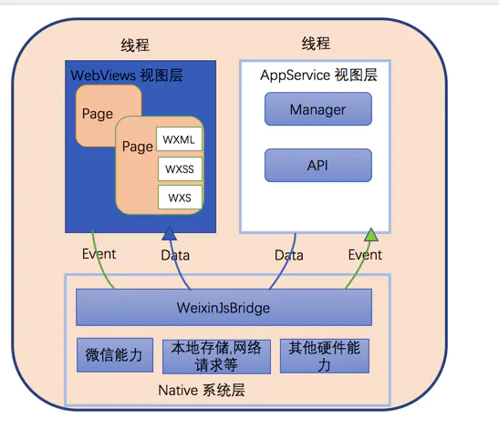

# 小程序 和 原生 native

## 剖析小程序底层

微信小程序的架构设计

小程序框架包含两部分，**WebView**视图层**AppService**逻辑层，两者运行在不同的分离的线程中，试图层运行在渲染线程，逻辑层运行在 JS Core，

1. WebView 视图层

   - 小程序视图层由 WXML 和 WXSS 编写，
   - 不同环境的**渲染容器**不同，在 iOS 中是**WKWebView**，安卓中是**chromium 定制内核**，开发工具中是**Chrome WebView**
   - 小程序存在多个界面，所以视图层存在多个 webView 线程

2. AppService 逻辑层

   - 逻辑层单独运行在 JS 容器中，因此并没有一个完整的浏览器对象，不能像 H5 一样操作 `BOM API` 和 `DOM API`
   - 不同环境的**JS 容器**不同，在 iOS 中是**JS Core**，安卓中是**V8**，开发工具中是**NWJS**
   - 逻辑层只有一个线程

3. 渲染层和逻辑层之间的通信

   - 视图层和逻辑层通过原生层面的 WeixinJsBridge 进行通信，逻辑层将数据的变化通过 jsBridge 传递给视图层完成更新，视图层监听用户的操作事件，通过 jsBridge 将事件传递给逻辑层完成数据处理
   - WeixinJsBridge（现在已经封装为 JS SDK） 是基于 Native 系统层，并且封装了一系列**微信能力/本地存储/网络请求/硬件能力**等等的桥梁，
   - 小程序视图层和逻辑层的数据传输是通过**evaluateJavascript**实现的。即用户传输的数据，需要将其转换为**字符串形式**传递，同时把转换后的数据内容拼接成一份 JS 脚本，再通过 JS 脚本的形式传递到两边独立环境。
   - 因为 evaluateJavascript 的执行会受很多方面的影响，数据到达视图层并不是实时的。因此`setData`方法是异步的

## 理解 JS bridge

1. 一句话解释：JS Bridge 是构建 Native 层和非 Native 层间消息通信的通道，而且是双向通道

**Native <=====> JS Bridge <=====> JavaScript**

2. 实现原理

类比 **_RPC_** (Remote Procedure Call 远程过程调用) 和 **JSONP**

- Native 层和 JS 层的通信可以看成是一次**RPC**调用，前端类比于**RPC**的客户端，Native 层是**RPC**的服务端
- JSBridge 的主要逻辑就分为：**通信调用**和**句柄解析调用**

3. JavaScript 调用 Native

- JavaScript 调用 Native 主要有两种方式：**注入 API** 和**拦截 URL SCHEME**
- **注入 API** 就是向 JS 的 Context(Window) 上挂载原生对象（_推荐使用_）
  - 对于 iOS 端 **WKWebView** 通过 `[userCC addScriptMessageHandler:self name:@"nativeBridge"]` 注入；JS 端就可以通过`window.webkit.messageHandlers.nativeBridge.xxx`的形式调用
  - 对于 Android 端 通过 `webView.addJavascriptInterface(myJavaScriptInterface, "nativeBridge");` 注入；JS 端就可以通过`window.nativeBridge.xxx`的形式调用
- **拦截 URL SCHEME** 就是通过 `[protocol]://[host]` 的形式，例如：`huajian://closeWebview` 等等的形式
  - Web 端通过某种方式（例如：`ifame.src` / `location.href` ）发送 URL Scheme 请求，Native 端通过拦截该请求处理业务逻辑
  - 该方式相对于注入 API 的方式，耗时更久

4. Native 调用 JavaScript

- JS 端通过字符串拼接的方式，将方法作为参数传给 Native 或者拼接到 URL Scheme，Native 执行拼接的 JavaScript 字符串
- 由于 Native 是从外部调用 JavaScript 的方法，因此 JavaScript 的方法必须挂载再全局 Window 对象上，
- Window 对象上的方法，为了避免函数名的重复，可以**拼接时间戳**，**ID 自增**或**使用 Symbol 类型**

## webview 和 iframe 的区别

webview

iframe

## 参考文章：

1. [微信小程序运行流程](https://juejin.im/post/5afd136551882542682e6ad7#heading-1)
2. [JSBridge 的原理](https://juejin.im/post/5abca877f265da238155b6bc)
