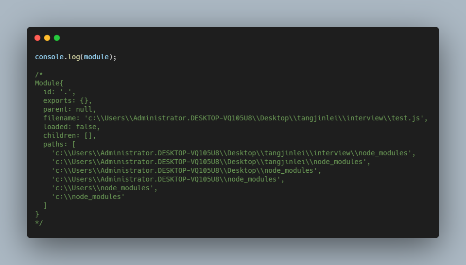

# Webpack 相关面试题

## 1. CommonJS 和 ES6 module

### CommonJS

- node.js 是该规范的主要实践者，通过`module`,`exports`,`require`,`global`四个主要的环境变量提供对模块化的支持；
- 依赖于 node.js 原生模块`module`实现，如下图：
  
  其中包含了`exports`**_(模块导出对象)_**、`children`**_(被该模块引用的子模块)_**, `paths`**_(模块搜索的路径)_**等等；
- 原理：Node 在解析 JS 模块时，会将内容进行包裹，传入变量。再通过`vm.runInThisContext(code)`[文档](http://nodejs.cn/api/vm.html#vm_vm_runinthiscontext_code_options)将`code`编译并执行代码, 伪代码如下：

  ```javascript
  const wrap = function (script) {
    return Module.wrapper[0] + script + Module.wrapper[1];
  };

  const wrapper = ['(function(exports, require, modeule, __filename, __dirname){ ', '\n});'];
  ```

- 基本语法

  ```javascript
  // a.js
  module.exports = {
    num: 1,
  };

  // index.js
  const a = require('./a.js');
  console.log(a.num); // 1
  ```

### ES6 Module

- 新一代的模块标准， 通过`export`,`export defalut`,`import`来完成模块的导出和引入；
- 基本语法

  ```javascript
  // a.js
  export const num = 1;
  export default { count: 2 };

  // index.js
  import a, { num } from './a.js';
  console.log(a.count); // 2
  console.log(num); // 1
  ```

### 两者的区别

1. `CommonJS` 模块输出的是一个值的拷贝， `ES6` 模块输出的是值的引用;
2. `CommonJS` 采用同步加载模块的策略，因此适合服务端编程

## 2. Webpack 中 module/chunk/bundle 的概念

[Webpack 官方文档](https://webpack.js.org/glossary/)对于三者的解释：

- `Module`：Discrete chunks of functionality that provide a smaller surface area than a full program. Well-written modules provide solid abstractions and encapsulation boundaries which make up a coherent design and clear purpose.(译：比完整项目更小的独立的功能模块。一个编写良好的 module 基于可靠的抽象和封装，可以保持设计的一致性，明确设计目的)
- `Chunk`：This webpack-specific term is used internally to manage the bundling **process**. Bundles are composed out of chunks, of which there are several types (e.g. entry and child). Typically, chunks directly correspond with the output bundles however, there are some configurations that don't yield a one-to-one relationship.(译：Chunk 是 webpack 中独有的用于管理打包流程的名词。Bundles 是由 Chunk 组成的，分为好几种类型，例如 entry 和 child。通常 Chunks 和打包输出的 bundle 是一一对应的，但是有些配置项不会产生一对一的关系)
- `Bundle`： Produced from a number of distinct modules, bundles contain the **final versions** of source files that **have already undergone** the loading and compilation process.(译：由不同的模块生成，Bundles 包含经历了加载和编译过程的源文件的最终版本)

更通用的理解：`webpack`中一切文件都是一个`module`，在`webpack`打包编译过程中，一系列的`module`就构成了一个`chunk`，打包完成后，一个`chunk`或者一系列的`chunk`就构成了一个`bundle`

参考：[stackoverflow 的文章：what-are-module-chunk-and-bundle-in-webpack](https://stackoverflow.com/questions/42523436/what-are-module-chunk-and-bundle-in-webpack)

## 3. Webpack 构建流程

初始化构建参数 ===> 绑定事件钩子回调 ===> 确定 Entries 逐一遍历 ===> 使用 loader 编译文件 ===> 输出文件

- 初始化构建参数：`Webpack`首先会读取你在命令行内传入的配置以及项目里`webpack.config.js`里的配置，用于初始化本次构建的配置参数
- 绑定事件钩子回调：执行配置文件中的`plugins`实例化语句，生成`Compiler`传递给各个`plugin`的`apply`方法，将各个自定义钩子挂载到`webpack`事件流
- `webpack`读取配置的`entries`参数，从入口文件开始递归遍历所有的文件
- 在递归遍历文件时，`webpack`开始`Compilation`编译过程，根据配置文件中的`loader`参数对`test`到的文件内容进行编译（buildModule），之后再将编译好的文件内容使用`acorn`解析生成`AST`静态语法树，分析文件的依赖关系逐个拉去依赖模块并重复上述编译过程，最后将所有模块的`require`语法替换成`__webpack__require`来模拟模块化的操作
- 最后是`emit`阶段，也就是文件输出阶段，我们可以在传入时间的回调`compilation.assets`拿到所需的数据，包括即将输出的资源，代码块`chunk`等等信息

## 4. 动态加载或者按需加载的原理

动态加载原理核心点：

1. 通过 `webpack` 将需要进行懒加载的路由组件打包成独立的文件，也就是`code split` 或者 `splitChunk`
2. 借助JSONP的形式来实现延迟执行加载代码

具体实现：

### link 标签中的懒加载概念

`<link>`标签中`rel`属性值`preload`和`prefetch`的作用和区别

1. `preload` 表示预加载，用来加载当前页面中重要的资源，`preload`不会阻塞`window`的`onload`事件。
2. `prefetch` 表示预获取，允许浏览器在空闲时间来获取将来可能用到的资源，并加他们存储在浏览器缓存中。
3. 两者的区别在于`preload`专注于当前页面，并以高优先级加载资源；而`prefetch`则专注于下一个页面或下一步操作将要加载的资源，并以低优先级加载；

例如：

```html
<!-- 表示xxx1是当前页面需要的资源 -->
<link rel="preload" href="xxx1.js" as="script" />
<!-- 表示预加载image.png图片资源 -->
<link rel="preload" href="image.png" />
<!-- 表示xxx2是下一个页面需要的资源，进行预获取缓存到本地 -->
<link rel="prefetch" href="xxx2.js" />
```

### webpack 中的动态导入

webpack 中动态导入有 2 种方式

1. ES6 的动态加载模块：`import()`，内部实现用到了 ES6 的*Promise*

   - `import`函数返回一个 promise 对象，动态的加载模块
   - 调用`import`之处被视为一个代码分割点，被请求的模块和它引用的所有子模块，会分割到一个单独的 chunk 中
   - 使用内联的注释(Magic Comment)可以进行个性化的配置，例如：

     ```javascript
     import(
       /* webpackChunkName: 'my-chunk-name' */
       /* webpackNode: 'lazy' */
       /* webpackExports: ["default", "named"] */
       'module'
     );

     // 将 webpackIgnore 设置为 true 则不进行代码分割
     import(/* webpackIgnore: true*/ 'ignore-module.js');

     // vue中常见的路由懒加载写法：
     const routes = [
       {
         path: '/',
         name: 'Home',
         component: () => import(/* webpackChunkName: "home" */ '../views/Home.vue'),
       },
     ];
     const router = new VueRouter({
       routes,
     });
     export default router;
     ```

2. webpack 的特定预发`require.ensure`（已被遗弃）

### webpack 中的预加载和预获取模块（preload/prefetch module）

webpack 中也可以通过定义 Magic Comments 来定于资源加载方式：

`prefetch`的方式

- 假设现在的需求是按需实现点击登录按钮，加载登录弹窗，
- JS 中代码为`LoginButton.onclick = () => import(/* webpackPrefetch: true */ 'LoginModal')`
- 经过 webpack 打包编译后会生成`<link rel="prefetch" href="login-model-chunk.js">`插入到页头部，指定资源加载方式

`preload`的方式

- 假设有个*chartComponent*依赖于一个较大的*chartLibraray*，所以将其拆分到一个单独的*chunk*
- JS 中代码为`import(/* webpackPreload: true */ 'ChartingLibrary');`
- 经过 webpack 打包编译会生成`<link rel="preload" href="chartingLibrary.js" as="script">`插入到页头部，指定资源加载方式

**prefetch**和**preload**在**webpack chunk**中的不同：

- *preload chunk*会在*父 chunk* 加载时，以并行方式加载。_prefetch chunk_ 会在*父 chunk* 加载结束后加载
- _preload chunk_ 具有中等优先级，并立即下载。_prefetch chunk_ 在浏览器闲置时下载
- _preload chunk_ 会在*父 chunk* 中立即请求，用于当下时刻。*prefetch chunk*用于未来的某个时刻

### webpakc 借助 JSONP 的形式执行模块

TODO: 源码

### 参考文档：

1. [理解 Vue 的路由懒加载](https://juejin.im/post/6844904180285456398)
2. [路由懒加载的原理讲解](https://blog.csdn.net/weixin_44869002/article/details/106288371)
3. [webpack 模块方法 import](https://webpack.docschina.org/api/module-methods/#import)
4. [什么是 Preload，Prefetch 和 Preconnect](https://github.com/fi3ework/blog/issues/32)

## 5. exports和module.exports
